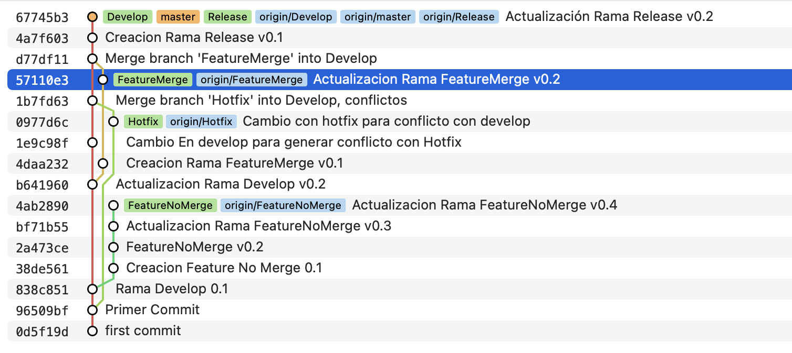

## Tarea Entornos de Desarrollo Tema 18

Adrián García García

Cambio en master v0.1, primer commit conflicto resuelto

Creacion Rama Hotfix
Creacion Rama Develop
Actualizacion Rama Develop v0.2

Creacion Rama FeatureMerge v0.1

Actualizacion Rama FeatureMerge v0.2

Creacion Rama Release v0.1

Actualización Rama Release v0.2

## Comandos básicos git
### Git Clone
Con git clone, haremos el primer fetch de un repositorio, alimentando el repositorio local, su sintaxis es la siguiente:
git clone <https://name-of-the-repository-link>

### Git branch
Crearemos nuevas ramas con: git branch <branch-name>
Visualizaremos todas las ramas con: git branch --list
Borraremos una rama con: git branch -d <branch-name>

### Git checkout
Cambiaremos el head a una rama distinta con: git checkout <name-of-your-branch>

### Git add
Con git add, marcaremos los ficheros cambiados para que se guarden en el siguiente commit: git add <file>
También podremos añadir todos los ficheros actualizados: git add -A

### Git Commit
Con git commit, guardaremos los cambios marcados en staged en el repositorio local: git commit -m "commit message"

### Git push
Con git push, actualizaremos el repostorio remoto con todos los cambios del repositorio local: git push <remote> <branch-name>

### Git pull
Con git pull, descargaremos las actualizaciones del repositorio remoto, resolviendo los conflictos con nuestro repositorio local: git pull <remote>

### Git revert
Con git revert, volveremos atrás al commit identificado por el hash sin borrar el commit actual para poderlo recuperar en un futuro

### Git reset
Con git reset, podremos eliminar el commit actual, moviendo la cabeza tantos commits atras como se indiquen: git reset --hard head~1    

### Git merge
Con git merge, unificaremos dos ramas resolviendo los conflictos, para ello nos moveremos a la rama principal a la que queramos unir la rama secundaria: git checkout <main-branch>
Actualizaremos nuestro repositorio de la rama principal: git fetch
Por último, unificaremos las ramas: git merge <branch-name>

## Esquema de commits

